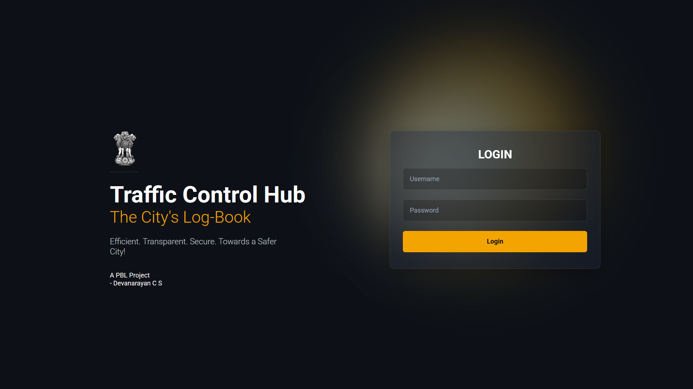
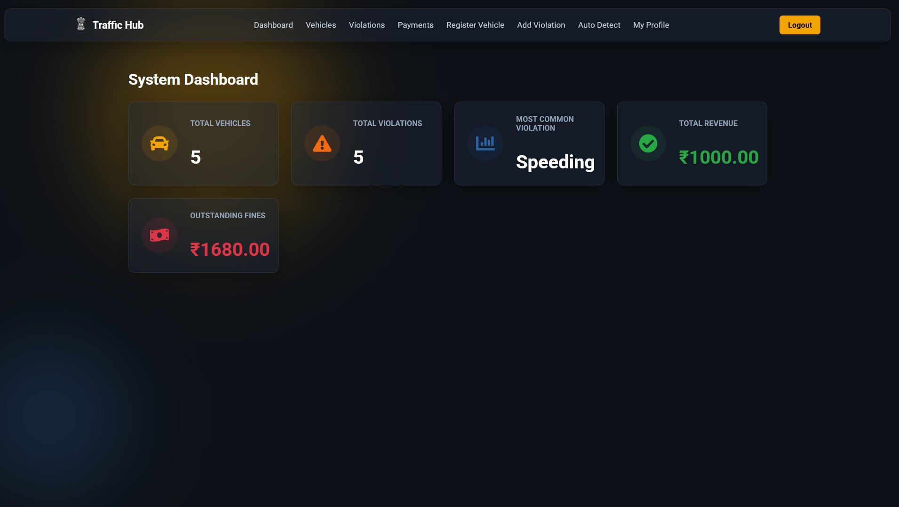
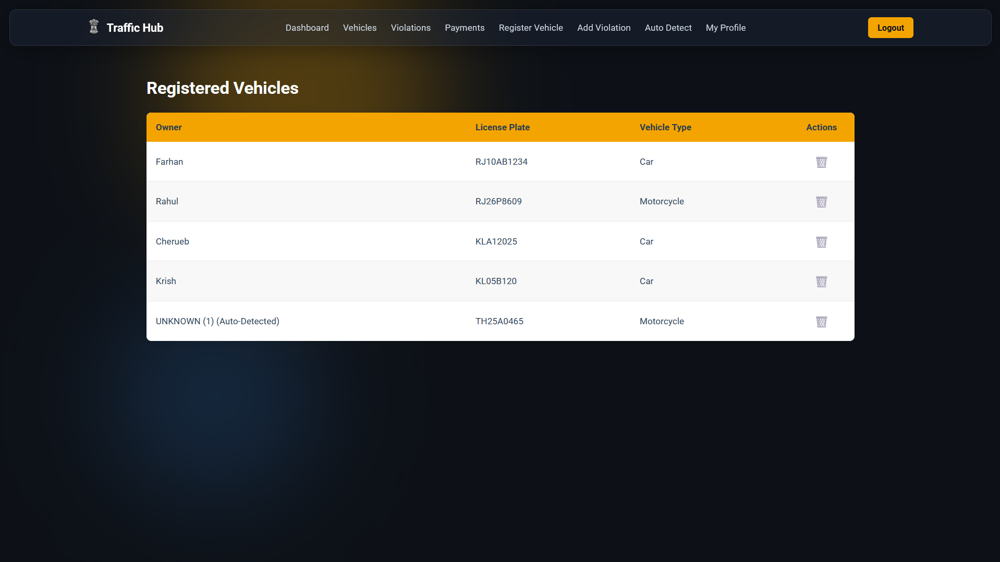
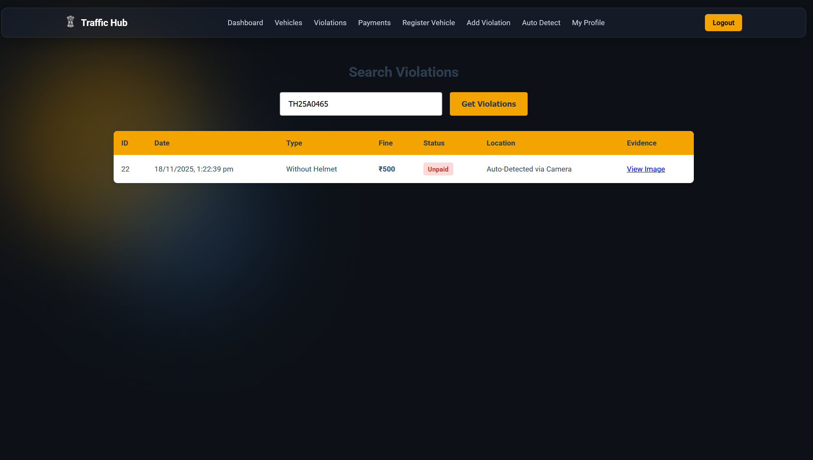
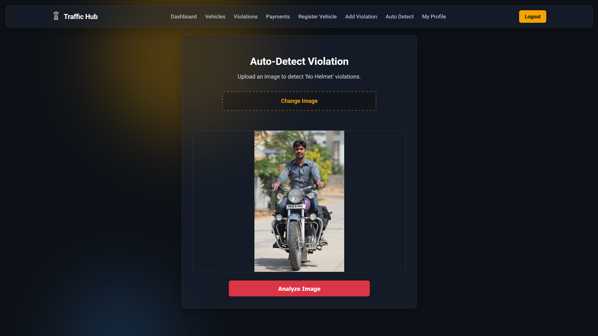
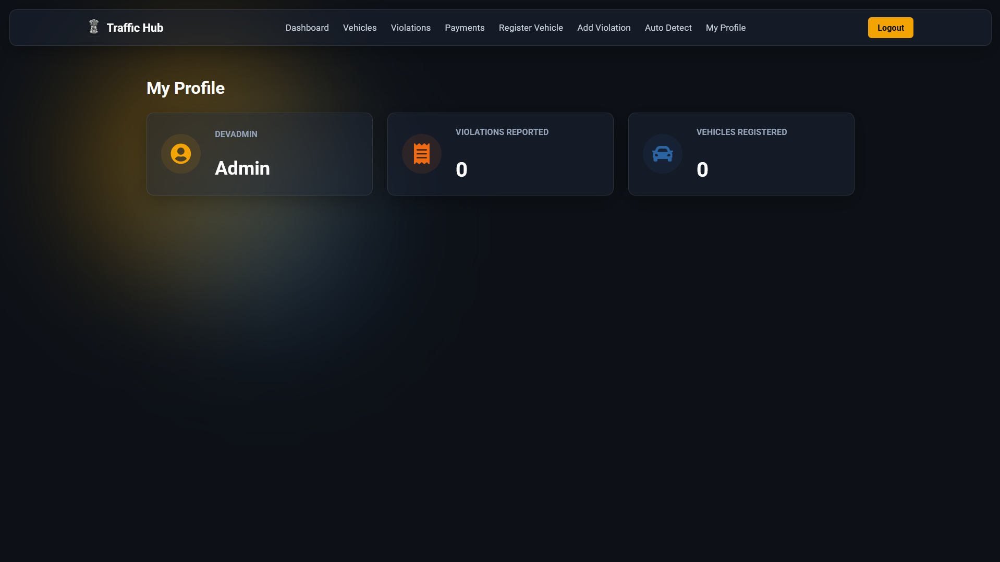

# 🚦 Traffic Management System with AI Detection & Blockchain Auditing

A full-stack **Traffic Management System** built with **Flask, React, MySQL, Web3, and AI**. The system manages vehicles, violations, and payments while incorporating an **AI-powered helmet violation detector**, **interactive 3D IoT simulations**, and an **immutable blockchain audit trail** to ensure data integrity.

## ⭐ Key Features

### 🔐 Authentication

* Login & registration
* Password hashing (bcrypt)
* JWT-based authorization
* Admin/user role support

### 🚗 Vehicle Management

* Add, view, search, and delete vehicles
* Auto-registration of unknown vehicles detected through AI or IoT
* Admin-only delete access

### ⚠️ Violation Management

* Add violations manually
* View violations per vehicle
* Check violation details
* Update fine status after payment
* **Live Geographic Map:** Real-time plotting of incidents across Rajasthan using Leaflet and OpenStreetMap.

### 🤖 AI Violation Detection

Uses **YOLOv8** + **EasyOCR** to automatically detect:

#### ✔ Helmet Status

* Detects With Helmet / Without Helmet
* Creates bounding boxes + labels on the image

#### ✔ License Plate OCR

* Detects license plate
* Extracts plate number using OCR
* Auto-registers vehicle if not found
* Auto-inserts violation into MySQL
* Saves annotated evidence image

**API:** `POST /autodetect`

### ⛓️ Immutable Blockchain Audit Trail

Ensures database integrity by running alongside the traditional MySQL database:
* Generates a unique SHA-256 cryptographic hash of every violation payload.
* Automatically anchors the hash to a local Ethereum network via a Solidity smart contract (`ViolationAuditV2`).
* **Verification Engine:** Allows admins to cross-reference MySQL records against the immutable blockchain ledger to instantly detect database tampering.

### 📡 3D IoT Radar Gun Simulation

An interactive WebGL digital twin for testing IoT ingestion:
* **3D Environment:** Built with React Three Fiber, featuring a controllable vehicle and dynamic lighting.
* **Automated Triggers:** Automatically fires secure API requests when the simulated vehicle exceeds 90 km/h.
* Validates API key, auto-registers unknown vehicles, and logs the "Speeding" violation.

**API:** `POST /iot/report-speeding`

### 📊 Dashboard Stats

Provides summary stats:

* Total vehicles
* Total violations
* Total fines paid/unpaid
* Most common violation

### 👤 User Profile Stats

* Username
* Role
* Violations reported
* Vehicles registered

## 🧠 Machine Learning Models

* YOLOv8 helmet detection → `Weights/best.pt`
* YOLO license plate detection → `license_plate_detector.pt`
* OCR → EasyOCR
* OpenCV for image processing

## 🗄 Database & Smart Contracts

**MySQL Tables:**
* `loginuser`
* `Vehicle`
* `Violations`
* `Fines`

**Ethereum Smart Contracts:**
* `ViolationAuditV2.sol` (Maintains state lifecycle and evidence hashes on the blockchain)

## 📸 Screenshots

### 🔐 Login Page



### 📊 Dashboard



### 🚗 Vehicles Page



### ⚠️ Violations Page



### 🤖 Auto-Detection



### 👤 My Profile



## 🛠️ Tech Stack

* **Backend:** Python, Flask, MySQL, JWT, bcrypt
* **AI & Computer Vision:** PyTorch, YOLOv8, EasyOCR, OpenCV, NumPy
* **Blockchain:** Solidity, Ganache, Web3.py
* **Frontend:** React.js, Axios, React Router, React Three Fiber (3D WebGL), React-Leaflet (Maps)
## ▶️ How to Run the Project

1. Install Python dependencies:

```
pip install -r requirements.txt
```

2. Create MySQL database `TrafficDB` and import `TrafficDB.sql`.
3. Start your local Ganache Ethereum workspace on port 8545.
4. Run backend:

```
python app.py
```

4. Run frontend:

```
cd traffic-violation-frontend
npm install
npm start
```

## 📦 Folder Structure

```
Traffic-Management-System-With-Ai/
├── app.py
├── iot_radar_gun.py
├── TrafficDB.sql
├── Weights/
├── evidence_uploads/
├── blockchain/
├── audit/
├── traffic-violation-frontend/
└── screenshots/
```

## 📄 License

Academic & educational use.

## 🙌 Acknowledgments

YOLOv8, EasyOCR, OpenCV, Flask, React, and Web3 communities.
